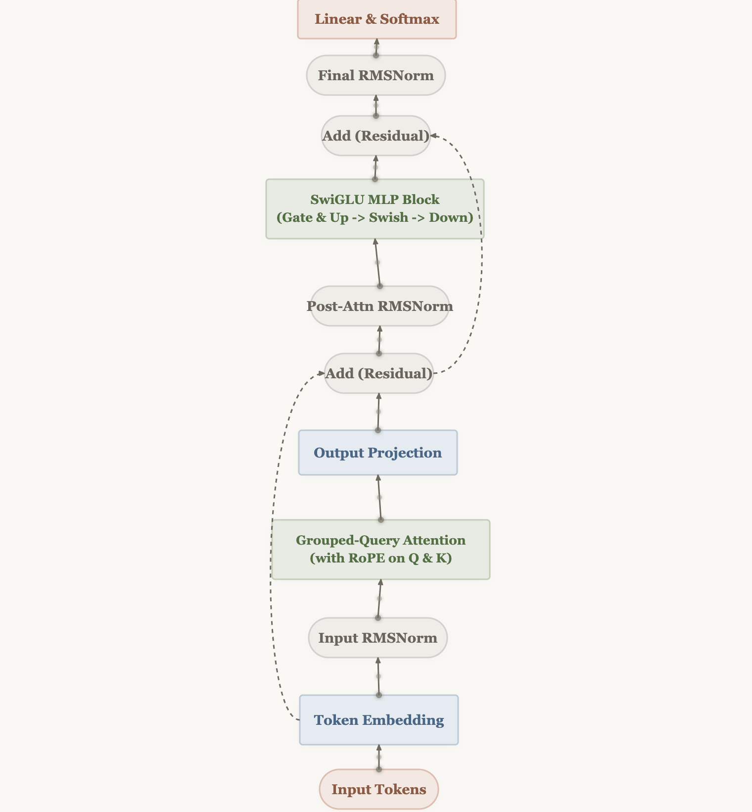
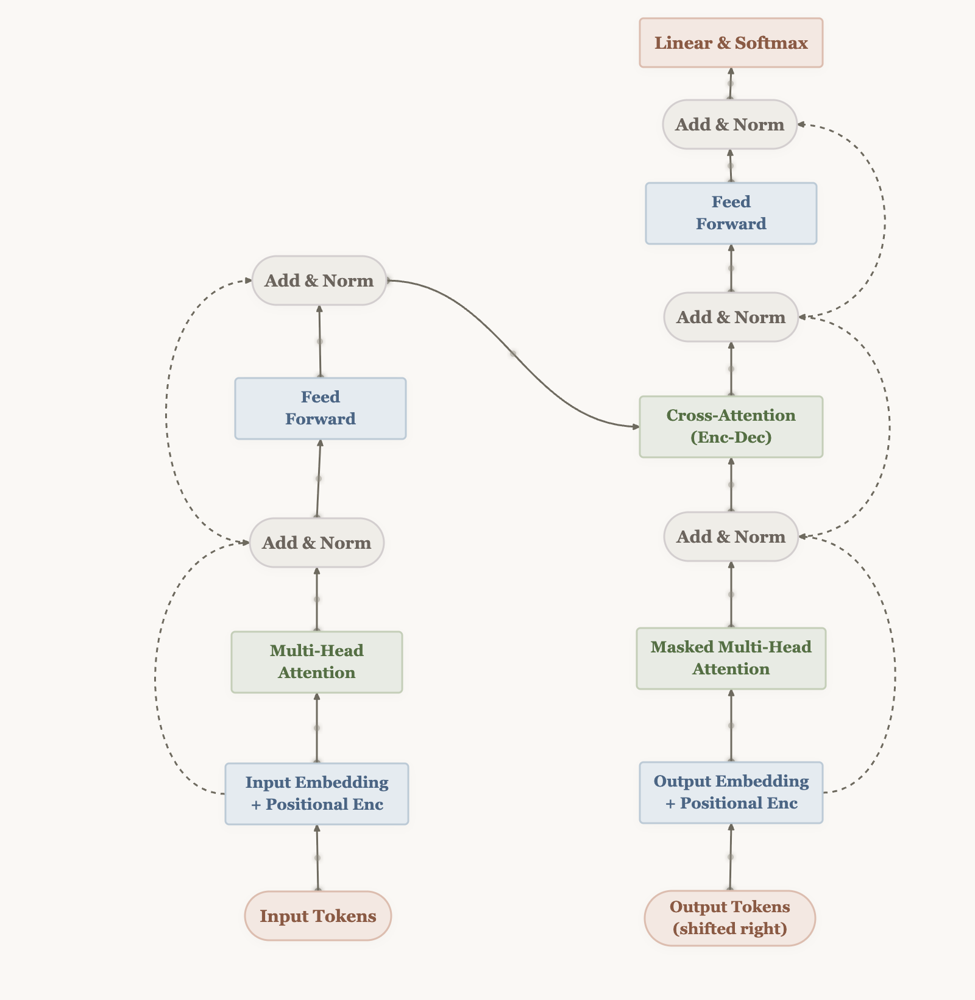
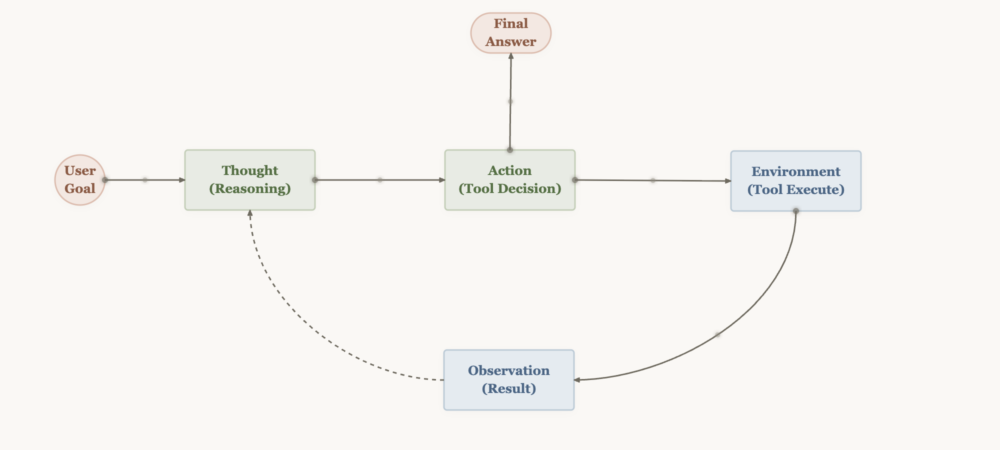
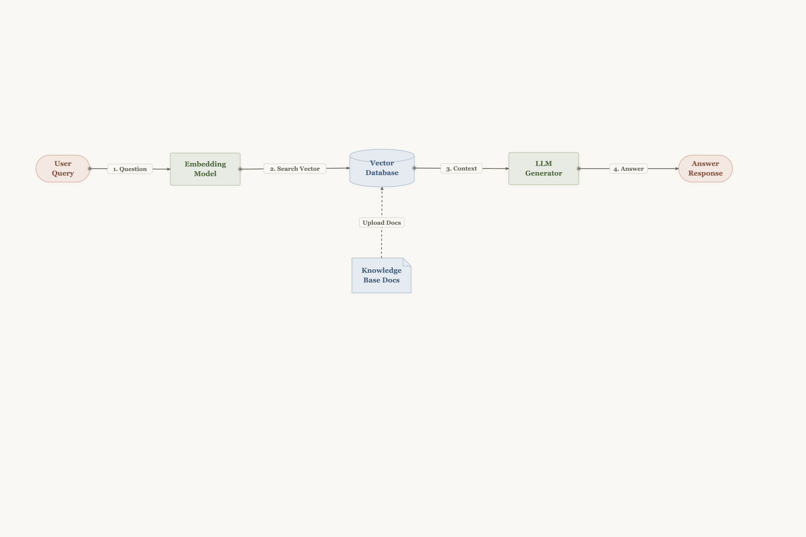
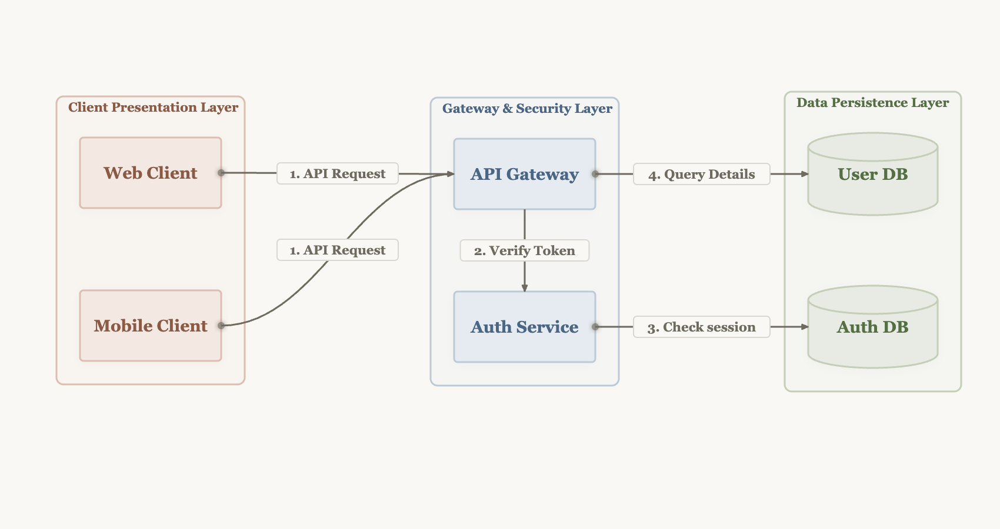
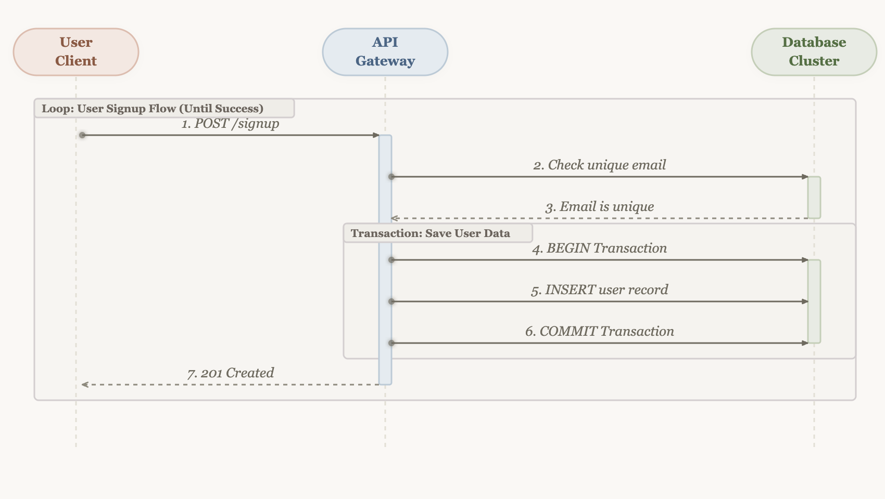

# draw-morandi-diagram-skill

**A diagram-drawing skill for AI agents.** Generate publication-quality sequence diagrams and flowcharts in a warm, editorial Morandi style — define by JSON, preview live, drag to refine, export SVG/PNG/GIF.

---

## 🌟 What It Is

`draw-morandi-diagram-skill` is an agent-invokable skill that produces **beautiful diagrams with a warm editorial aesthetic** (think Anthropic blog, Morandi palette). It's designed to be called by coding agents (Claude Code, Codex, etc.) when they need to visualize architecture, flows, or sequences.

| Feature | What you get |
|---|---|
| **Diagram types** | Sequence diagrams + Flowcharts |
| **Theme** | Morandi desaturated palette (Red/Gray/Green/Blue) on warm ivory paper |
| **Live preview** | Python server + React frontend, drag & drop editing |
| **Flow animation** | Moving dots on solid lines, dash-scroll on dashed lines |
| **Arrow styles** | 5 types: filled, open, triangle, diamond, circle |
| **Routing** | Bezier (curved) or orthogonal (right-angle) paths |
| **Auto layout** | Dagre-powered automatic node positioning (LR direction) |
| **Export** | SVG (vector), PNG (HiDPI), GIF (animated loop) |
| **Input** | Simple JSON spec — write it directly or let the agent generate it |
| **Editing** | Drag nodes, adjust curves, toggle animations, edit JSON in real-time |

---

## 🎨 Examples

### Decoder-Only LLM Architecture
Flowchart showing the transformer decoder block: token embedding → GQA with RoPE → SwiGLU MLP → residual connections.



### Transformer Encoder-Decoder
Full Transformer architecture with encoder-decoder structure, cross-attention, and positional encoding.



### ReAct Agent Loop
Sequence diagram of the ReAct pattern: Thought → Action → Observation → Final Answer.



### RAG Retrieval Pipeline
Sequence diagram for Retrieval-Augmented Generation: query → embed → retrieve → generate.



### Flowchart with Groups
Flowchart demonstrating group/container boundary boxes, Bezier curve routing, and node categories.



### Sequence Diagram with Groups
Sequence diagram with combined fragment groups, activation bars, and self-loop calls.



---

## 📂 Project Structure

```text
draw-morandi-diagram-skill/
├── examples/                        # Example JSON specs + rendered PNGs
├── frontend/                        # React + TypeScript + Vite app
│   ├── src/
│   │   ├── components/              # Canvas, Header, Sidebar, NodeShape
│   │   ├── store/                   # Zustand state management
│   │   ├── types.ts                 # TypeScript types
│   │   ├── constants.ts             # Morandi theme colors
│   │   └── utils/
│   │       └── pathMidpoint.ts      # Path-length midpoint extraction
│   ├── src/__tests__/               # Vitest unit tests (31 tests)
│   ├── dist/                        # Compiled build (static hosting)
│   └── package.json
├── skills/
│   └── draw-diagram/
│       └── scripts/server.py        # Python preview + save API server
├── *.json                           # Diagram JSON spec files (root level)
└── README.md
```

---

## 🚀 Quick Start

### For Humans (preview & edit)
```bash
python3 skills/draw-diagram/scripts/server.py --dir .
```
Open http://localhost:8000/ in your browser.

### Headless Rendering (PNG screenshots)
```bash
python3 skills/draw-diagram/scripts/server.py --render diagram.json --output output.png
```
Requires Playwright: `pip install playwright && playwright install chromium`.

### For Agents (generate & save)
Agents can write JSON spec files to disk, then launch the server to let humans preview/edit. JSON schema is documented in `skills/draw-diagram/SKILL.md`.

---

## 🔑 Features Detail

### Drag & Drop Editing
- Drag any node on canvas — coordinates sync to JSON in real-time
- Marquee selection + Shift-click for batch moves
- Snap ports at 4 cardinal directions (top/bottom/left/right)

### Smart Bezier & Orthogonal Routing
- Auto-detect obstacles and route curves around overlapping nodes
- Bypass Offset slider (0–100px) to control curve clearance
- Per-connection curvature overrides
- **Orthogonal routing**: Set `"routing": "orthogonal"` on connections for right-angle paths
- Labels on orthogonal connections are positioned at the path-length midpoint

### Arrow Styles (5 types)
Each connection supports one of five arrowhead styles:
- `"filled"` — solid triangle (default)
- `"open"` — V-shape open arrow
- `"triangle"` — wider bold filled triangle
- `"diamond"` — diamond shape
- `"circle"` — small filled circle

### Auto Layout (Dagre)
Set `autoLayout: true` at the root of the JSON spec to automatically compute node positions using dagre (left-to-right layout). Combined with `routing: "orthogonal"`, connection routing points are also auto-computed.

### Flow Animation
- **Solid lines**: Moving glow dot along the path (directional indicator)
- **Dashed lines**: Scroll dash offset animation
- Toggle separately for solid and dashed animations

### Export
| Format | Use case |
|---|---|
| SVG | Vector, editable in Illustrator/Figma |
| PNG | HiDPI (2x), ready for docs/presentations |
| GIF | Animated loop, 3s cycle, 30fps |

---

## 🧪 Testing

The project uses **Vitest** for unit tests covering the pure-function transformation layer:

```bash
cd frontend && npm test
```

31 tests across 4 test files cover: node dimensions, path midpoint calculation, connection endpoint geometry, and dagre auto layout. All tests run headlessly without a DOM/browser.

---

## 🧠 Agent Integration

This skill is designed to be loaded and invoked by AI coding agents that support skill systems (Hermes, Claude Code, etc.). An agent can:

1. Parse a user's request into a diagram JSON spec
2. Write the JSON to disk
3. Launch the preview server
4. Iterate with the user on placement/layout
5. Export the final PNG and deliver it

The full JSON schema reference lives in `skills/draw-diagram/SKILL.md`.

---

## 📜 License

MIT
